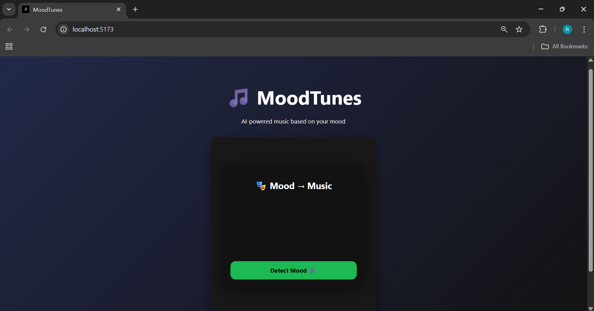

# 🎧 MoodTunes – AI-Powered Music Recommendation App

MoodTunes is an AI-powered web application that detects a user’s facial emotion using a webcam and recommends Spotify playlists that match the detected mood — removing the need for manual music searching.

---

## ✨ Features

- 🎭 **Real-time facial emotion detection** using webcam
- 🧠 **AI-based emotion classification** (DeepFace)
- 🎵 **Emotion-based Spotify playlist recommendations**
- 📊 **Mood history tracking dashboard**
- 🎨 Clean, responsive UI built with React
- 🔒 Secure handling of API keys using environment variables

---

## 🛠️ Tech Stack

### Frontend
- React (Vite)
- Axios
- react-webcam

### Backend
- Flask
- DeepFace
- TensorFlow
- OpenCV

### APIs
- Spotify Web API

---

## ⚙️ Setup Instructions

### Backend
```bash
cd backend
python -m venv venv
source venv/bin/activate  # Windows: venv\Scripts\activate
pip install -r requirements.txt
cp .env.example .env
python app.py
```

### Frontend
```bash
cd frontend
npm install
npm run dev
```

### Environment Variables
Create a .env file in backend/
```bash
SPOTIFY_CLIENT_ID=your_client_id
SPOTIFY_CLIENT_SECRET=your_client_secret
```

---

## Preview


---

## How It Works?

- User allows webcam access
- A snapshot is captured
- Backend AI model detects facial emotion
- Emotion is mapped to a predefined Spotify playlist
- Playlist opens automatically in Spotify
- Detected moods are saved in history for analysis

